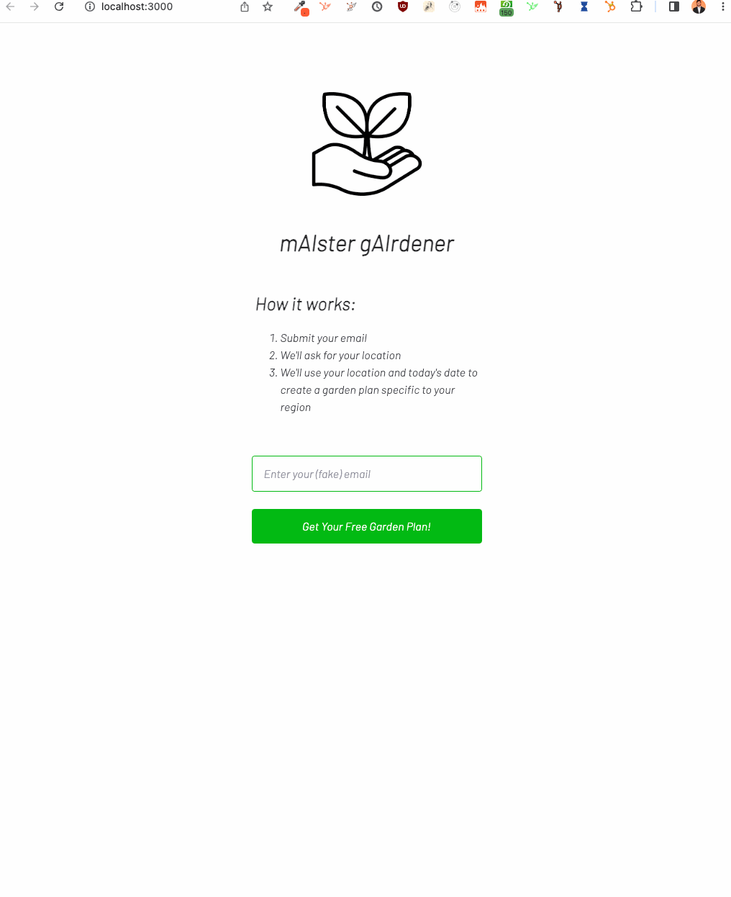

# mAIster bAIker: an AI garden planner

This is an example lead gen tool for an imaginary garden company. Submit your email (or nothing, for this demo). The app will ask for your browser location, then use your coordinates and the current date to prompt openAI's text-davinci-003 to create a garden plan tailored to your location and the current growing season. This project is not hosted anywhere. See steps below to run locally.

This project is built using:
- OpenAI (text-davinci-003 and JS library)
- Next.js for react server-side rendering and to build an endpoint to safely authenticate with openAI

  

## Running mAIster gAIrdener locally
1. Install the dependencies: `npm install`
2. Build the extension: `npm run dev`
3. Open on local host: http://localhost:3000
